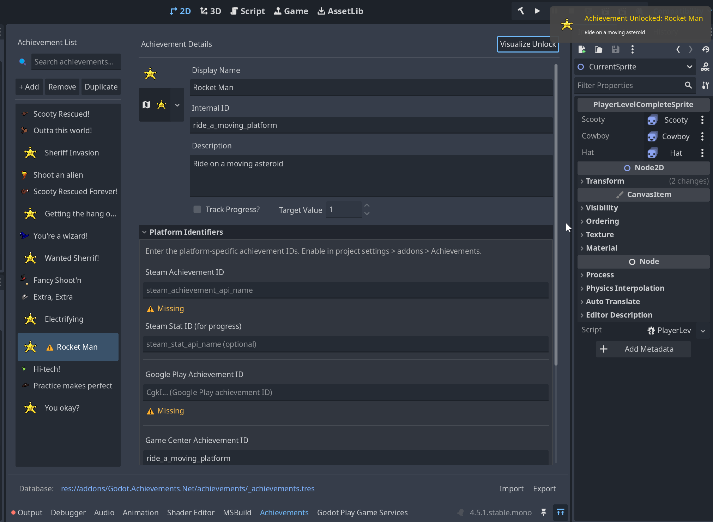

# 🏆 Godot.Achievements.NET

A cross-platform achievement system for Godot 4+ with C#/.NET support. Abstracts platform-specific achievement APIs behind a unified interface, making it easy to ship to Steam, iOS, and Android with a single codebase.



## 📑 Table of Contents

- [✨ Features](#-features)
- [🎮 Supported Platforms](#-supported-platforms)
- [📦 Installation](#-installation)
- [🚀 Quick Start](#-quick-start)
- [🛠️ Setup Achievements in the Editor](#️-setup-achievements-in-the-editor)
- [⚙️ Enable Different Providers](#️-enable-different-providers)
- [🔧 Adding a Custom Provider](#-adding-a-custom-provider)
- [🤝 Contributing](#-contributing)
- [📋 Roadmap](#-roadmap)

## ✨ Features

- **Cross-platform abstraction** - Single API for Local, Steam, Game Center, Google Play, and custom providers
- **Visual editor** - Manage achievements from a dedicated editor dock
- **Built-in toast notifications** - Configurable unlock notifications with custom scene support
- **Local-first persistence** - Achievements saved locally, synced to platforms (on unlock + on launch)
- **Progress tracking** - Support for incremental/progressive achievements
- **Extensible** - Add custom providers by implementing a simple interface

## 🎮 Supported Platforms

| Platform | Provider | Required Addon |
| ---------- | ---------- | ---------------- |
| **Local/Offline** | `LocalAchievementProvider` | Built-in |
| **Steam** | `SteamAchievementProvider` | [Godot.Steamworks.NET](https://github.com/ryan-linehan/Godot.Steamworks.NET) |
| **iOS Game Center** | `GameCenterAchievementProvider` | [GodotApplePlugins](https://github.com/migueldeicaza/GodotApplePlugins) |
| **Google Play** | `GooglePlayAchievementProvider` | [godot-play-game-services](https://github.com/Suspended/godot-play-game-services) |

## 📦 Installation

1. Copy the `Demo/addons/Godot.Achievements.Net` folder to your project's `addons/` directory
2. Build the project
3. Enable the plugin in **Project > Project Settings > Plugins**

> 💡 **Tip:** It might help to reload the project before continuing to setting up your achievements

## 🚀 Quick Start

### 1. Unlock Achievements in Code

```csharp
// Unlock an achievement
AchievementManager.Instance.Unlock("first_blood");

// For progressive achievements
achievements.IncrementProgress("kill_100_enemies", 1);
```

### 2. Listen for Events

```csharp
AchievementManager.Instance.AchievementUnlocked += (id, achievement) => {
    GD.Print($"Unlocked: {achievement.DisplayName}");
};
```

---

## 🛠️ Setup Achievements in the Editor

Once the plugin is enabled, you'll find an **Achievements** dock at the bottom of the editor (next to Output, Debugger, etc.).

### Creating Achievements

1. Click the **+** button in the dock to add a new achievement
2. Fill in the required fields:
   - **Internal ID** - Unique identifier used in code (e.g., `first_blood`)
   - **Display Name** - Player-facing name shown in toasts and UI
   - **Description** - What the player did to earn it
   - **Icon** - Optional texture for toast notifications

### Progressive Achievements

For achievements that require multiple steps (e.g., "Kill 100 enemies"):

1. Check **Incremental** in the achievement details
2. Set **Max Progress** to the target value
3. Use `IncrementProgress()` in code instead of `Unlock()`

### Platform IDs

When you enable a platform provider, additional fields appear in the editor:

- **Steam ID** / **Steam Stat ID** - IDs from your Steamworks dashboard
- **Game Center ID** - Achievement ID from App Store Connect
- **Google Play ID** - Achievement ID from Google Play Console

The editor validates that enabled platforms have their IDs filled in and shows warnings for missing values.

### Custom Properties

Custom properties let you store additional metadata on achievements, such as IDs for unsupported platforms or game-specific data.

**Key behavior:** Custom properties are shared across all achievements as a schema. When you add a property to one achievement, it appears on every achievement in your database.

- Click **Add Property** to create a new property key
- Set the value type (string, int, float, bool, etc.) using the type picker
- Rename a property key to rename it across all achievements
- Removing a property removes it from all achievements

This is particularly useful for custom providers - see [Adding a Custom Provider](#-adding-a-custom-provider).

> 💡 **Tip:** You can even set a property to use Godot resources!

### Import/Export

Use the import/export buttons to:

- Export achievements to JSON for backup or version control
- Import achievements from JSON or CSV files

### Code Generation

Enable auto-generation in **Project Settings > Addons > Achievements > Codegen** to generate a C# constants class:

```csharp
// Generated AchievementConstants.cs
public static class AchievementConstants
{
    public static class Ids
    {
        public const string FirstBlood = "first_blood";
        public const string Kill100Enemies = "kill_100_enemies";
    }
}

// Usage - type-safe achievement references
AchievementManager.Instance.Unlock(AchievementConstants.Ids.FirstBlood);
```

---

## ⚙️ Enable Different Providers

You can enable different built-in provider integrations via **Project Settings > Addons > Achievements > Platforms**:

| Setting | Description |
| --------- | ------------- |
| `Steam Enabled` | Enable Steam achievements via [Godot.Steamworks.NET](https://github.com/ryan-linehan/Godot.Steamworks.NET) |
| `GameCenter Enabled` | Enable iOS/macOS Game Center achievements |
| `GooglePlay Enabled` | Enable Google Play Games achievements |

The local provider is always active and serves as the source of truth. Platform providers sync achievements to/from their respective services.

### Platform Requirements

Each provider requires its respective SDK addon to be installed and configured:

**🎮 Steam:**

1. Install [Godot.Steamworks.NET](https://github.com/ryan-linehan/Godot.Steamworks.NET)
2. Initialize the SDK in your project (the addon provides a `GodotSteamworks` autoload)
3. Enable `Steam Enabled` in project settings for the achievements plugin

**🍎 Game Center (iOS/macOS):**

1. Install [GodotApplePlugins](https://github.com/migueldeicaza/GodotApplePlugins)
2. Configure Game Center in App Store Connect
3. Enable `GameCenter Enabled` in project settings for the achievements plugin

**🤖 Google Play Games:**

1. Install [godot-play-game-services](https://github.com/Suspended/godot-play-game-services)
2. Configure your app in Google Play Console
3. Enable `GooglePlay Enabled` in project settings for the achievements plugin

Providers only initialize when their setting is enabled AND the SDK reports it's available at runtime. This allows the same build to gracefully handle missing SDKs.

---

## 🔧 Adding a Custom Provider

If you need the plugin to work with a new provider (for example Epic Games, a console, etc.) that isn't officially supported, you can register one via the achievement manager by creating a class that implements `IAchievementProvider` or extends `AchievementProviderBase`:

```csharp
public class MyPlatformProvider : AchievementProviderBase
{
    public override string ProviderName => "MyPlatform";
    public override bool IsAvailable => MyPlatformSDK.IsInitialized;

    public override void UnlockAchievement(string achievementId)
    {
        var achievement = _database.GetById(achievementId);
        var platformId = achievement?.MyPlatformId;
        MyPlatformSDK.Unlock(platformId);
    }

    // Implement other required methods...
}
```

To track the platform's ID, use the custom properties section in the editor UI.

> ⚠️ **Note:** You will want to use preprocessor statements to make sure your game can cross-compile across different OSes. For the default providers this is done for you. See `<Provider>.Stubs.cs` for examples.

## 🤝 Contributing

Contributions are welcome! Here's how you can help:

1. **Report bugs** - Open an issue describing the problem and steps to reproduce
2. **Suggest features** - Open an issue describing your idea and use case
3. **Submit PRs** - Fork the repo, make your changes, and submit a pull request

## 📋 Roadmap

- [ ] Documentation: Steam integration setup guide
- [ ] Documentation: Game Center integration setup guide
- [ ] Documentation: Google Play Games integration setup guide
- [ ] CI/CD examples for each supported OS/Provider

## 💖 Support

I'm building this plugin for my own upcoming game targeting Steam, iOS, and Android.

If this plugin helps your game, consider:

- ⭐ Starring this repo
- 🎮 Checking out my games on [itch.io](https://rcubdev.itch.io)

## 🤖 AI Disclosure

This plugin was developed with assistance from generative AI tools. Plugin was architected, reviewed, and tested by humans.

## 📄 License

MIT License - see [LICENSE](LICENSE) for details.
